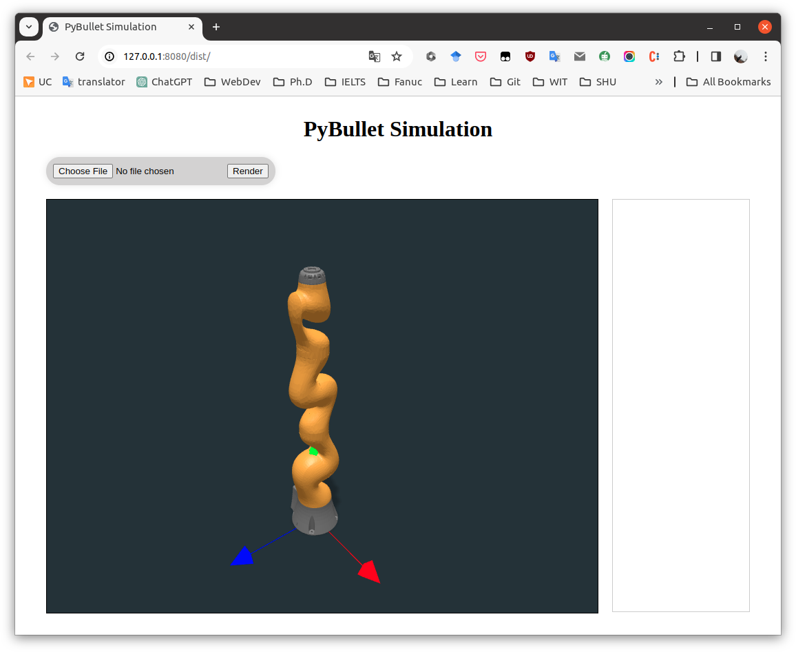

# WebRenderer

Welcome to the WebRenderer project! WebRenderer is a cutting-edge, web-based rendering engine designed to seamlessly integrate complex visualizations and simulations directly into web applications. By leveraging the robust backend framework provided by Django and the advanced dynamics capabilities of the pybullet engine, WebRenderer enables developers to embed high-quality graphical content and simulations into websites, significantly enhancing user engagement and experience.

## Features

* **Django Backend**: Utilizes the powerful and flexible Django framework to manage web applications, data flow, and RESTful services efficiently.
* **pybullet Dynamics Engine**: Incorporates the pybullet dynamics and physics engine for accurate and realistic 3D simulations.
* **3D Rendering**: Supports the rendering of 3D models and animations in real-time within any modern web browser, providing an immersive user experience.
* **Simulation Integration**: Offers capabilities to embed detailed physics-based simulations, making it ideal for educational, engineering, and entertainment applications.
* **Responsive Design**: Ensures a seamless viewing experience across a wide range of devices, including desktops, tablets, and smartphones.




## Getting Started

Before you begin, ensure you have the following installed on your system:

- Python (3.8 or newer)
- pip (to install Python packages)
- Node.js and npm (for front-end development)

### Installation

1. Clone the WebRenderer repository to your local machine:

   ```
   git clone https://github.com/GilbertPan97/WebRenderer.git
   ```

2. Navigate to the project directory:
   ```
   cd WebRenderer
   ```

3. Install the required Python packages and activate venv:

   ```
   source venv.sh
   ```

4. Install front-end dependencies:

   ```
   npm install
   ```

5. Build the front-end assets:

   ```
   npm run pack
   ```

6. Run the Django development server:

   ```
   npm run django-server
   ```

Then, open your web browser and navigate to `http://127.0.0.1:8000/` to view the application.

## Usage

To use WebRenderer in your project, follow the detailed documentation provided in the `docs` folder. The documentation covers how to integrate 3D models, set up simulations, and customize rendering settings to suit your application's needs.

## Contributing

Contributions to WebRenderer are welcome! If you have suggestions for improvements or bug fixes, please feel free to fork the repository and submit a pull request. For substantial changes, please open an issue first to discuss what you would like to change.

Please ensure to update tests as appropriate and adhere to the project's code of conduct.

## License

WebRenderer is open-source software licensed under the MIT license. See the `LICENSE` file for more details.

## Acknowledgments

- Thanks to the Django community for the robust web framework.
- Gratitude to the developers of pybullet for their excellent dynamics engine.